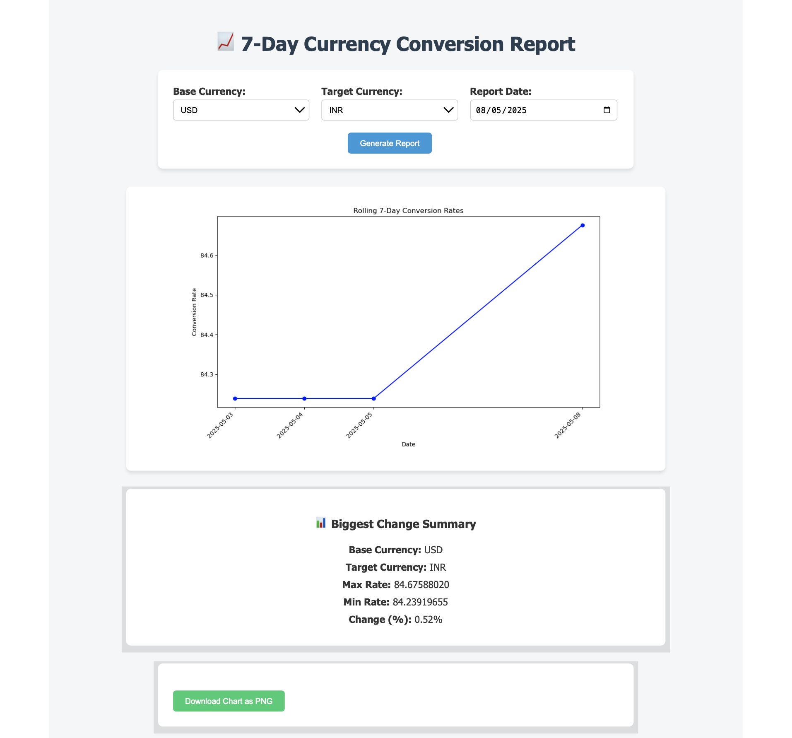

# 💱 Currency Conversion Report
## 🖼️ Screenshot
Here is what the app interface looks like:




# 💱 Currency Conversion Report

This project is a web application that provides a 7-day currency conversion report. The app fetches daily exchange rates from the FloatRates API, stores them in a MySQL database, and allows the user to generate a report with a chart and the biggest currency rate change.

---

## 🚀 Features
- Fetches the latest exchange rates from the FloatRates API and stores them in a MySQL database.
- Displays a line chart of conversion rates for the last 7 days between selected base and target currencies.
- Allows users to select a currency pair (USD ↔ EUR, EUR ↔ INR, INR ↔ USD).
- Supports date selection for generating reports for any specific date (defaults to today).
- Displays the biggest rate change (max and min values) between the selected currencies.

---

## ⚙️ Prerequisites

To get started, make sure you have the following installed:

- **Python 3.x** (Make sure `pip` is also installed with Python)
- **MySQL** 
- **Flask**
- **Logging**
- **Requests**
- **Matplotlib**
- **Jinja2 Templates**
- **MySQL Connector for Python**

# 🖥️ Using the Web App
On the homepage, you'll see:

A form to select:

Base Currency (USD, EUR, INR)↔ Target Currency↔ Report Date (defaults to today)

In Middle Page : A line chart of conversion rates for the last 7 days
At Bottom Page : A summary box showing the biggest % change in rates


# 📁 Project Structure


# 📌 Notes
- The ETL script runs manually for now — to automate, schedule it with cron (Linux/Mac) or Task Scheduler (Windows).
- The app uses Coordinated Universal Time (UTC) date/time for consistency.
- Avoid reloading the same rates due to the UNIQUE constraint on (base_currency, target_currency, date).

# ✅ Quick Copy Paste Commands
## Clone, install and run everything:

- git clone https://github.com/your-username/currency-conversion-report.git
- cd currency-conversion-report
- python -m venv venv
- source venv/bin/activate
- pip install -r requirements.txt
- mysql -u root -p < create_tables.sql
- python etl_script.py
- python app.py

- Then open http://localhost:5000 in your browser.

---

## 🛠️ Setup Instructions in details :

# Clone this repository to your local machine:

```bash
# 1. Clone the Repository

- git clone https://github.com/your-username/currency-conversion-report.git
- cd currency-conversion-report

# 2. Create and Activate a Virtual Environment

- python -m venv venv
- source venv/bin/activate         # On Windows: venv\Scripts\activate

# 3. Install Python Dependencies

- pip install -r requirements.txt
# If you don't have requirements.txt, create one with:
- pip install flask mysql-connector-python matplotlib requests
- pip freeze > requirements.txt

# 4. Set Up the MySQL Database

## Log into MySQL and run the schema file:

# This creates the database currency_rates and the conversion_rates table.
- mysql -u root -p < create_tables.sql


# 5. Configure Database Credentials

# In both etl_script.py and app.py, update the database configuration:

db_config = {
    'host': 'localhost',
    'user': 'root',          # ← Replace with your actual MySQL user
    'password': '',          # ← Replace with your actual MySQL password
    'database': 'currency_rates'
}

# 6. Run the ETL Job

# This script fetches daily exchange rates and loads them into the database. Run it manually (or later via a cron job):

- python etl_script.py
# Log file will be created at logs/etl.log.

# 7. Start the Web App

- python app.py
- Visit: http://localhost:5000


